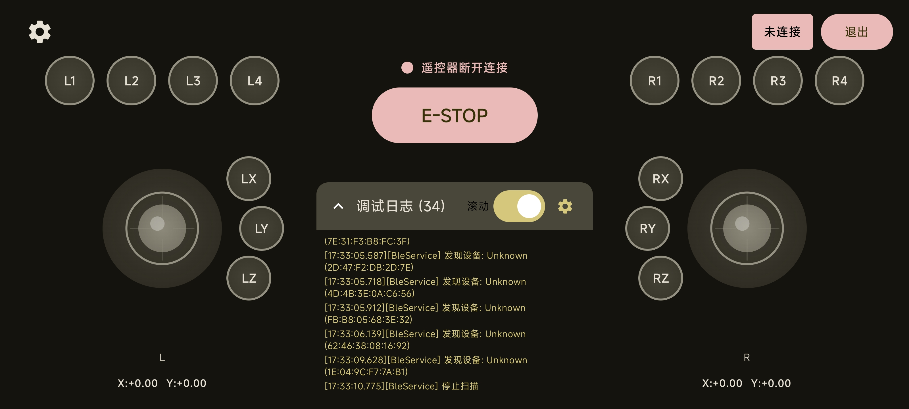

# JRemote Controller

JRemote Controller 是一个基于蓝牙低功耗 (BLE) 的远程控制应用，允许用户通过 Android 设备控制 ESP32 等嵌入式设备。




## 项目结构

```
JRemote_Controller/
├── android_app/          # Android 应用程序
│   └── app/src/main/java/com/example/jremote/
│       ├── bluetooth/    # 蓝牙连接与通信
│       ├── wifi/        # Wi-Fi UDP 连接与通信
│       ├── components/  # 可复用 UI 组件
│       ├── data/        # 数据模型和持久化
│       ├── screen/      # 界面 screens
│       └── viewmodel/   # 业务逻辑
├── firmware/             # ESP32 固件
│   ├── arduino_demo/    # Arduino Demo 版本
│   └── zephyr_app/      # Zephyr RTOS 生产版本
├── boards/              # 硬件设计文件
│   └── esp32s3_develop/ # ESP32-S3 开发板配置
└── sample/              # 接收端示例代码
    ├── arduino/         # Arduino 接收端
    ├── linux/           # Linux Python 脚本
    ├── stm32_hal/      # STM32 HAL 库例程
    └── stm32_zephyr/   # STM32 Zephyr RTOS 例程
```

## 固件开发路径

| 阶段 | 框架 | 描述 |
|------|------|------|
| Demo 版本 | Arduino | 快速原型验证功能 |
| 最终版本 | Zephyr RTOS | 生产级固件，支持 USB HID |

> 注意：两套代码需要保持 API 兼容

## 主要功能

### 连接模式
- **局域网模式（Wi-Fi）**：手机与 ESP32 连接同一 Wi-Fi 网络，UDP/WebSocket 通信（推荐）
- **AP 模式（Wi-Fi 直连）**：手机连接 ESP32 热点，UDP/WebSocket 通信
- **蓝牙模式（BLE）**：传统低功耗蓝牙连接
- **USB HID 模式**：ESP32 作为 USB HID 设备，模拟 Xbox 手柄

### 遥控界面
- **双操纵杆控制**：左右两个操纵杆，可发送精确的位置数据
- **按钮控制**：支持多个可配置的按钮，包括普通按钮和切换按钮
- **自由拖拽**：摇杆、按钮可以随意拖拽到任意位置
- **调整大小**：组件支持调整尺寸
- **添加/删除组件**：可添加新的摇杆、按钮或删除已有组件
- **组件属性**：编辑组件名称、颜色、形状
- **多页面支持**：支持多个控制页面（Page 1, Page 2...）

### 功能映射
- **指令配置**：每个按钮可配置发送的指令（字节数组）
- **摇杆映射**：摇杆数据可配置映射方式（直接值、按钮映射）
- **快捷指令**：支持预设快捷指令（如急停、复位）
- **宏命令**：支持录制和播放序列指令

### 预设系统
- **预设保存**：保存当前界面为预设（JSON 格式）
- **预设加载**：一键加载预设
- **预设管理**：增删改预设
- **内置预设**：出厂自带多套预设模板
- **预设导入导出**：分享预设文件

### 预设模板（开箱即用）

| 预设名称 | 描述 | 适用场景 |
|----------|------|----------|
| 基础遥控 | 双摇杆 + 4 按钮 | 入门 |
| 小车控制 | 摇杆 + 方向按钮 | 移动机器人 |
| 飞行模式 | 双摇杆 + 切换开关 | 无人机/穿越机 |
| 机械臂 | 多摇杆 + 多个按钮 | 机械臂控制 |
| 调试面板 | 纯传感器显示 + 指令输入 | 调试 |
| 虚拟手柄 | 专为 USB HID 手柄设计 | 电脑游戏 |
| 虚拟键盘 | 键盘/快捷键输入 | 树莓派等嵌入式设备 |
| 虚拟鼠标 | 摇杆控制移动 + 按钮点击 | 嵌入式设备远程控制 |

### 其他功能
- **底部导航栏**：连接界面使用底部导航栏切换模式
- **WiFi 配网功能**：通过 BLE 配置 ESP32 的 WiFi SSID 和密码
- **一键获取当前 WiFi**：自动读取手机当前连接的 WiFi 名称
- **实时状态反馈**：显示连接状态、信号强度和通信延迟
- **调试面板**：显示详细的通信日志和设备响应
- **设置持久化**：所有配置自动保存
- **急停功能**：一键紧急停止，发送特殊帧头标识
- **触觉反馈**：按下按钮时设备震动反馈
- **自动重连**：连接断开后自动尝试重新连接
- **主题模式**：支持跟随系统、深色、浅色三种主题模式
- **跟随主题色**：可选跟随手机壁纸颜色（仅 Android 12+）

## 技术栈

- **Android**：Kotlin、Jetpack Compose、Material Design 3
- **Android 架构**：MVVM + StateFlow + DataStore
- **蓝牙通信**：BLE (Bluetooth Low Energy)
- **Wi-Fi 通信**：UDP、WebSocket
- **ESP32 固件（Demo）**：Arduino 框架
- **ESP32 固件（生产）**：Zephyr RTOS
- **USB HID**：ESP32-S3 USB OTG 模拟 Xbox 手柄/键盘/鼠标

## 系统要求

- Android 设备：Android 6.0 (API 23) 或更高版本
- 支持 BLE 的 ESP32 或其他嵌入式设备
- 蓝牙权限：位置权限（用于蓝牙扫描）和蓝牙权限

## 快速开始

### 1. 准备 ESP32 设备

选择以下固件之一：

- **Demo 版本（推荐先试用）**: `firmware/arduino_demo/firmware_demo/`
- **生产版本（Zephyr RTOS）**: `firmware/zephyr_app/`
- **接收端示例**: `sample/` 目录下各种平台示例

将固件烧录到 ESP32 设备，确保设备已启动并运行。

### 2. 安装 Android 应用

前往 [Releases](https://github.com/HFO4AR/JRemote_Controller/releases) 页面下载最新版本的 APK 文件，直接安装到您的 Android 设备上。

### 3. WiFi 配网（首次使用）

ESP32 需要连接 WiFi 才能使用局域网模式。以下是配网步骤：

#### 方式一：BLE 配网（推荐）

1. **进入配网模式**
   - 首次上电后，ESP32 会自动进入 BLE 配网模式
   - 如果已连接 WiFi，运行时按下 **GPIO0** 按钮可重新进入配网模式

2. **手机连接 ESP32**
   - 打开 JRemote Controller 应用
   - 底部导航栏切换到 **AP** 或 **局域网** 模式
   - 点击右上角 **"配网"** 按钮

3. **扫描并连接配网模块**
   - 点击 "扫描 ESP32 设备"
   - 选择 "ESP32_Config" 设备
   - 等待连接成功

4. **配置 WiFi**
   - 可点击 "读取当前 WiFi" 自动填充手机当前连接的 WiFi
   - 输入 WiFi 密码（开放网络留空）
   - 点击 "发送配置"

5. **等待连接**
   - 配网成功后，ESP32 会自动重启并连接 WiFi
   - LED 指示：绿色呼吸灯 = 连接成功，红色慢闪 = 连接失败

#### 方式二：直接连接（AP 模式）

1. 手机连接 ESP32 热点（SSID: `JRemote_ESP32`，密码: `12345678`）
2. 应用中选择 **AP 模式** 扫描设备

### 4. 连接设备

#### 局域网模式（推荐）

1. 确保手机和 ESP32 连接同一 WiFi
2. 打开应用，底部导航栏选择 **局域网**
3. 点击 "扫描" 发现同一网络中的 ESP32 设备
4. 点击设备连接

#### 蓝牙模式

1. 打开应用，底部导航栏选择 **蓝牙**
2. 扫描并选择您的 ESP32 设备
3. 等待连接成功

#### AP 模式

1. 手机连接 ESP32 热点
2. 打开应用，选择 **AP 模式**
3. 扫描并连接设备

### 5. 开始控制

1. 连接成功后，返回控制界面
2. 点击 "开始发送" 按钮
3. 使用操纵杆和按钮控制您的设备

---

## LED 状态指示

| 状态 | LED 颜色/行为 |
|------|---------------|
| 配网模式 | 蓝色快闪 |
| WiFi 连接中 | 白色快闪 |
| WiFi 连接成功 | 绿色呼吸灯 |
| WiFi 连接失败 | 红色慢闪 |
| 收到控制数据 | 青色闪烁 |

## 通信协议

### BLE 服务和特征

- **服务 UUID**: `4fafc201-1fb5-459e-8fcc-c5c9c331914b`
- **发送特征 (TX)**: `beb5483e-36e1-4688-b7f5-ea07361b26a8` - 用于从设备接收数据
- **接收特征 (RX)**: `6e400002-b5a3-f393-e0a9-e50e24dcca9e` - 用于向设备发送数据

### Wi-Fi UDP

- **数据端口**: 1034
- **发现端口**: 1035
- **发现协议**: UDP 广播
- **设备广播内容**: `JREMOTE:{设备名称}:{IP}:{端口}`
- **Ping 请求**: `0x70` ('p')
- **Ping 响应**: `0x50` ('P')
- **设备响应**: 每次收到数据后自动回复 `0x50`

### 控制数据格式

控制数据以字节数组形式发送，总长度为 **9 字节**，格式如下：

#### 数据结构

| 字节位置 | 数据类型 | 描述 | 范围 |
|---------|---------|------|------|
| 0 | uint8_t | 头部字节 | 0xAA (正常) / 0xEE (急停) |
| 1 | int8_t | 左操纵杆 X 坐标 | -127 到 127 |
| 2 | int8_t | 左操纵杆 Y 坐标 | -127 到 127 |
| 3 | int8_t | 右操纵杆 X 坐标 | -127 到 127 |
| 4 | int8_t | 右操纵杆 Y 坐标 | -127 到 127 |
| 5 | uint8_t | 按钮状态位掩码 (位 0-7) | 0x00 到 0xFF |
| 6 | uint8_t | 按钮状态位掩码 (位 8-15) | 0x00 到 0xFF |
| 7 | uint8_t | 按钮状态位掩码 (位 16-23) | 0x00 到 0xFF |
| 8 | uint8_t | 按钮状态位掩码 (位 24-31) | 0x00 到 0xFF |

#### 帧头说明

- **0xAA**: 正常控制数据帧
- **0xEE**: 急停帧，所有控制数据为 0，MCU 应立即停止所有动作

#### 数据转换

- **操纵杆坐标**: 浮点数范围 -1.0 到 1.0 转换为 int8_t 范围 -127 到 127
- **按钮状态**: 每个按钮对应一个位，按下为 1，释放为 0

### 设备响应格式

#### 1. Ping 响应

- **请求**: 发送单字节 `0x70` ('p')
- **响应**: 设备应返回单字节 `0x50` ('P')
- **用途**: 测量通信延迟

#### 2. 控制数据响应

ESP32 接收端会处理控制数据并可能发送响应，格式如下：

| 字节位置 | 数据类型 | 描述 |
|---------|---------|------|
| 0 | uint8_t | 头部字节 `0xBB` |
| 1-4 | uint32_t | 时间戳（毫秒） |
| 5-7 | uint8_t[3] | 保留数据 |

#### 3. 其他响应

设备可以发送任意数据，应用会在调试面板中显示：
- 文本数据：直接显示为字符串
- 二进制数据：显示为十六进制格式

### 通信流程

1. **连接建立**:
   - 应用扫描 BLE 设备
   - 连接到目标设备
   - 发现 BLE 服务和特征
   - 启用通知

2. **数据发送**:
   - 应用每 20ms 发送一次控制数据
   - 数据包含操纵杆状态和按钮状态
   - 数据格式为 12 字节的二进制数据

3. **数据接收**:
   - 应用接收设备发送的响应
   - 处理 Ping 响应以计算延迟
   - 显示其他响应在调试面板

4. **断开连接**:
   - 应用主动断开连接
   - 或设备主动断开连接
   - 应用清理连接资源

### ESP32 接收端处理

ESP32 接收端的处理流程：

1. 等待并读取数据头部 `0xAA` 或 `0xEE`
2. 如果是 `0xEE`（急停帧）：立即停止所有电机和动作
3. 如果是 `0xAA`（正常帧）：读取 8 字节的控制数据
4. 解析操纵杆数据和按钮状态：
   - 字节 1-2: 左操纵杆数据（X, Y）
   - 字节 3-4: 右操纵杆数据（X, Y）
   - 字节 5-8: 按钮状态位掩码
5. 应用死区处理（默认 10）
6. 映射操纵杆值到电机控制范围（-255 到 255）
7. 处理按钮状态
8. 定期发送调试信息

## 应用界面

> 界面采用 Material Design 3 设计规范，支持深色/浅色主题和动态主题色（Android 12+）

### 控制界面

- **左操纵杆**: 控制左侧设备功能
- **右操纵杆**: 控制右侧设备功能
- **按钮区域**: 显示可配置的按钮
- **状态栏**: 显示连接状态、RSSI 和延迟
- **调试面板**: 显示通信日志

### 连接界面

- **自动扫描**: 进入界面自动开始扫描附近 BLE 设备
- **扫描设备列表**: 显示附近的 BLE 设备名称和信号强度
- **连接控制**: 连接、断开设备

### 设置界面

- **数据发送**: 调整发送间隔 (10-100ms)
- **界面设置**: 显示/隐藏调试面板、触觉反馈开关、切换按钮布局、主题模式选择、跟随主题色开关
- **蓝牙设置**: 自动重连开关
- **按键配置**: 启用/禁用按钮、切换模式设置、编辑按键名称和 KeyCode

### 配网界面

- **BLE 扫描**: 扫描并连接 ESP32 配网模块
- **WiFi 配置**: 输入 WiFi SSID 和密码（或开放网络）
- **一键获取**: 读取手机当前连接的 WiFi 名称
- **状态反馈**: 实时显示配网进度（等待配置、连接中、成功、失败）
- **自动重连**: ESP32 配网成功后自动连接 WiFi 并重启

## 开发说明

### 蓝牙权限

应用需要以下权限：

- Android 12 及以上：`BLUETOOTH_CONNECT` 和 `BLUETOOTH_SCAN`
- Android 6.0 到 11：`BLUETOOTH` 和 `BLUETOOTH_ADMIN`
- 位置权限：用于蓝牙扫描

### 自定义开发

1. **修改按钮配置**: 在 `ControlViewModel.kt` 中修改 `defaultButtonConfigs`
2. **调整通信频率**: 在设置界面调整发送间隔，或修改 `AppSettings` 默认值
3. **设置持久化**: 使用 `SettingsRepository` 和 DataStore 自动保存配置
4. **扩展功能**: 可以添加更多传感器数据或控制选项
5. **调试消息**: 使用 `DebugManager` 统一管理调试输出，修改 `data/DebugManager.kt` 即可调整显示逻辑

### ESP32 接收端开发

1. 使用示例代码作为基础
   - `sample/` 目录下有 arduino、linux、stm32_hal、stm32_zephyr 等接收端示例
2. 实现 BLE 服务和特征 或 UDP 端口
3. 解析接收到的控制数据
4. 根据控制数据执行相应操作
5. 每次收到数据后回复 `0x50` 用于延迟计算

#### ESP32 BLE 配网功能

示例代码支持通过 BLE 配置 WiFi 凭证：

- **BLE 服务 UUID**: `0000FFFF-0000-1000-8000-00805F9B34FB`
- **WiFi SSID 特征**: `0000FF01-0000-1000-8000-00805F9B34FB`
- **WiFi 密码特征**: `0000FF02-0000-1000-8000-00805F9B34FB`
- **状态特征**: `0000FF03-0000-1000-8000-00805F9B34FB`（通知）
- **命令特征**: `0000FF04-0000-1000-8000-00805F9B34FB`

#### ESP32 WS2812 LED 状态指示

支持 GPIO 48 连接 WS2812 RGB LED 显示状态：

| 状态 | LED 颜色/行为 |
|------|---------------|
| 配网模式 | 蓝色快闪 |
| WiFi 连接中 | 白色快闪 |
| WiFi 连接成功 | 绿色呼吸灯 |
| WiFi 连接失败 | 红色慢闪 |
| 收到控制数据 | 青色闪烁 |

#### ESP32 IO0 按钮

- **GPIO 0** 配置按钮：运行时按下进入 BLE 配网模式

### Zephyr 固件架构

Zephyr 固件采用传输层与数据处理层分离的分层架构：

```
┌─────────────────────────────────────────────────────────────────┐
│                         Transport Layer                          │
│  (只负责收发数据，通过消息队列将数据传递给 DataHandler)            │
├─────────────┬─────────────┬─────────────┬─────────────────────────┤
│    Ble      │   WifiAp    │   WifiSta   │   (未来扩展)            │
│  (BLE传输)   │  (AP模式)   │  (LAN模式)   │                         │
└──────┬──────┴──────┬──────┴──────┬──────┴─────────────────────────┘
       │             │             │
       ▼             ▼             ▼
┌─────────────────────────────────────────────────────────────────┐
│                        DataHandler (路由器)                       │
│  - 接收来自所有传输层的数据                                        │
│  - 根据帧头路由到对应的处理器                                      │
└───────────────────────────┬─────────────────────────────────────┘
                            │
            ┌───────────────┴───────────────┐
            ▼                               ▼
┌─────────────────────┐       ┌─────────────────────┐
│ ControlDataHandler  │       │  UserDataHandler    │
│ (控制数据处理)       │       │  (用户数据处理)      │
│ -> UART -> MCU      │       │  -> 回传给 App       │
└─────────────────────┘       └─────────────────────┘
```

#### 帧头定义

| 帧头 | 说明 |
|------|------|
| 0xAA | 控制数据 (9 bytes) |
| 0xBB | 用户数据 (变长) |
| 0xEE | 急停 |

#### 构建命令

```bash
# Android App
cd android_app && ./gradlew assembleDebug

# Zephyr 固件
cd firmware/zephyr_app
source .venv/bin/activate
west build -b esp32s3_devkitm/esp32s3/procpu app
west flash
```

### 硬件板型

#### ESP32-S3 开发板 (YD-ESP32-S3)

| 功能 | GPIO | 说明 |
|------|------|------|
| 配置按钮 | GPIO0 | 按下进入 BLE 配网模式 |
| RGB LED | GPIO48 | WS2812 可编程 RGB LED |
| MCU TX | GPIO37 | ESP32→MCU 通信 |
| MCU RX | GPIO36 | MCU→ESP32 通信 |

#### 接口说明

- **Type-C 接口 1**: 直通模拟串口（烧录 + 调试日志）
- **Type-C 接口 2**: CH340 转 TTL（ESP32 与 MCU 通信）
- **USB D+ / D-**: GPIO20 / GPIO19 (ESP32-S3 USB OTG)

## 故障排除

### 连接问题

- 确保 ESP32 设备已启动并运行
- 确保 Android 设备蓝牙已开启
- 检查设备是否在蓝牙范围内
- 尝试重新扫描设备

### 通信问题

- 检查 BLE 服务和特征 UUID 是否正确
- 确保 ESP32 代码正确实现了通信协议
- 查看调试面板中的错误信息

### 性能问题

- 调整发送间隔以平衡响应速度和电池消耗
- 确保 ESP32 设备处理能力足够
- 避免在同一区域有过多蓝牙设备

## 示例应用场景

- **机器人控制**: 控制移动机器人的方向和速度
- **智能家居**: 控制灯光、窗帘等智能设备
- **远程监控**: 控制摄像头云台
- **游戏手柄**: 作为游戏控制器使用

## 许可证

MIT License

## 版本历史

### v0.5.0
- 新增 USB HID 模式：ESP32 可作为 USB HID 设备，模拟 Xbox 手柄
- 新增虚拟手柄预设：专为 USB HID 手柄设计的预设模板
- 新增虚拟键盘预设：键盘/快捷键输入预设
- 新增虚拟鼠标预设：摇杆控制移动 + 按钮点击
- 新增自由拖拽布局：摇杆、按钮可随意拖拽到任意位置
- 新增调整大小功能：组件支持调整尺寸
- 新增添加/删除组件：可添加新的摇杆、按钮或删除
- 新增组件属性编辑：名称、颜色、形状
- 新增多页面支持：支持多个控制页面（Page 1, Page 2...）
- 新增指令配置：每个按钮可配置发送的指令（字节数组）
- 新增摇杆映射：摇杆数据可配置映射方式
- 新增预设保存/加载：JSON 格式保存界面配置
- 新增内置预设：出厂自带多套预设模板
- 新增预设导入导出：分享预设文件
- 新增 Zephyr RTOS 固件：生产级固件架构
- 新增上位机 Web 界面：实时数据绘图、指令发送

### v0.4.0
- 新增 WiFi 配网功能：通过 BLE 配置 ESP32 的 WiFi SSID 和密码
- 新增一键获取当前 WiFi：自动读取手机当前连接的 WiFi 名称
- 新增开放网络支持：无密码 WiFi 也能配置
- 新增 BLE 配网状态反馈：实时显示配网进度和结果
- 新增 ESP32 WS2812 LED 彩色状态指示：绿色（成功）、红色（失败）、蓝色（配网模式）等
- 新增 ESP32 IO0 按钮进入配网模式：运行时按下 GPIO0 按钮
- 新增连接界面底部导航栏：蓝牙/AP/局域网模式快速切换
- 新增 Wi-Fi UDP 连接支持：支持 AP 模式和局域网模式
- 新增设备发现功能：UDP 广播发现 Wi-Fi 设备
- 新增调试消息管理（DebugManager）：统一管理调试输出，MUC 消息以绿色显示
- 新增延迟计算优化：基于设备响应计算实际延迟
- 新增 Wi-Fi 信号强度显示：读取手机 WiFi RSSI

### v0.3.0
- 新增触觉反馈功能：按下按钮时设备震动反馈
- 新增自动重连功能：连接断开后自动尝试重新连接
- 新增切换按钮布局：支持一字排开和 2x2 网格布局
- 新增主题模式设置：支持跟随系统、深色、浅色三种模式
- 新增跟随主题色功能：可选跟随手机壁纸颜色（仅 Android 12+）
- 新增自定义主题：深色模式使用深蓝色风格，浅色模式使用米白色风格
- 极简连接界面：支持模式切换，显示简洁的设备列表
- UI 现代化：全面采用 Material Design 3 规范
- 优化设置界面交互体验

### v0.2.0
- 新增切换按钮布局选项：支持一字排开和 2x2 网格布局
- 新增应用设置功能：可配置发送间隔、调试面板显示等
- 新增急停功能：一键紧急停止，发送特殊帧头标识
- 重构控制界面布局，优化用户体验

### v0.1.0
- 初始版本
- 双操纵杆控制：左右两个操纵杆发送精确位置数据
- 按钮控制：支持多个可配置按钮，包括普通按钮和切换按钮
- BLE 蓝牙连接：扫描、连接、管理蓝牙设备
- 实时状态反馈：显示连接状态、信号强度 (RSSI) 和通信延迟
- 调试面板：显示详细通信日志和设备响应
- 设置持久化：所有配置自动保存

## 贡献

欢迎提交问题和拉取请求，帮助改进这个项目！
