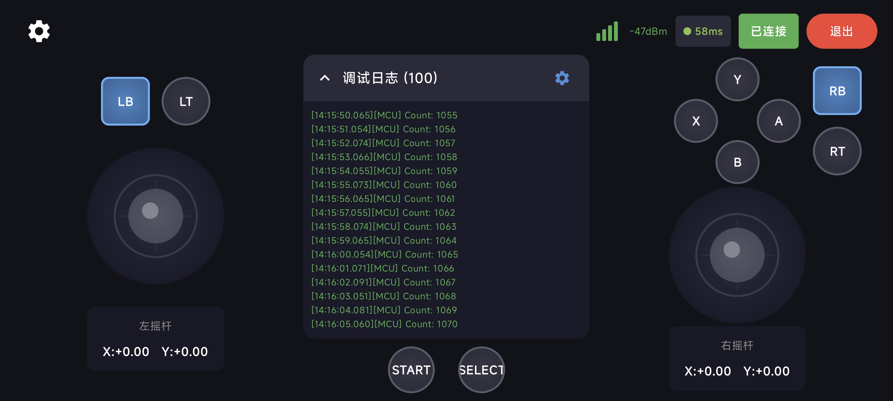

# JRemote Controller

JRemote Controller 是一个基于蓝牙低功耗 (BLE) 的远程控制应用，允许用户通过 Android 设备控制 ESP32 等嵌入式设备。



## 项目结构

```
JRemote_Controller/
├── android_app/          # Android 应用程序
│   ├── app/              # 应用主代码
│   │   └── src/main/java/com/example/jremote/  # 主要源代码
│   └── ...               # 构建配置文件
└── sample/               # 示例代码
    └── esp32_receiver/   # ESP32 接收端示例
```

## 主要功能

- **双操纵杆控制**：左右两个操纵杆，可发送精确的位置数据
- **按钮控制**：支持多个可配置的按钮，包括普通按钮和切换按钮
- **BLE 设备管理**：扫描、连接、断开和管理蓝牙设备
- **实时状态反馈**：显示连接状态、信号强度 (RSSI) 和通信延迟
- **调试面板**：显示详细的通信日志和设备响应
- **按钮配置**：可自定义按钮名称和功能

## 技术栈

- **Android**：Kotlin、Jetpack Compose
- **蓝牙通信**：BLE (Bluetooth Low Energy)
- **嵌入式设备**：ESP32

## 系统要求

- Android 设备：Android 6.0 (API 23) 或更高版本
- 支持 BLE 的 ESP32 或其他嵌入式设备
- 蓝牙权限：位置权限（用于蓝牙扫描）和蓝牙权限

## 快速开始

### 1. 准备 ESP32 设备

1. 打开 `sample/esp32_receiver/` 目录下的示例代码
2. 将代码上传到您的 ESP32 设备
3. 确保 ESP32 设备已启动并运行

### 2. 安装 Android 应用

1. 打开 `android_app/` 目录
2. 使用 Android Studio 打开项目
3. 构建并安装应用到您的 Android 设备

### 3. 连接设备

1. 打开 JRemote Controller 应用
2. 点击 "连接" 按钮
3. 扫描并选择您的 ESP32 设备
4. 等待连接成功

### 4. 开始控制

1. 连接成功后，返回控制界面
2. 点击 "开始发送" 按钮
3. 使用操纵杆和按钮控制您的设备

## 通信协议

### BLE 服务和特征

- **服务 UUID**: `4fafc201-1fb5-459e-8fcc-c5c9c331914b`
- **发送特征 (TX)**: `beb5483e-36e1-4688-b7f5-ea07361b26a8` - 用于从设备接收数据
- **接收特征 (RX)**: `6e400002-b5a3-f393-e0a9-e50e24dcca9e` - 用于向设备发送数据

### 控制数据格式

控制数据以字节数组形式发送，总长度为 **9 字节**，格式如下：

#### 数据结构

| 字节位置 | 数据类型 | 描述 | 范围 |
|---------|---------|------|------|
| 0 | uint8_t | 头部字节 | 0xAA |
| 1 | int8_t | 左操纵杆 X 坐标 | -127 到 127 |
| 2 | int8_t | 左操纵杆 Y 坐标 | -127 到 127 |
| 3 | int8_t | 右操纵杆 X 坐标 | -127 到 127 |
| 4 | int8_t | 右操纵杆 Y 坐标 | -127 到 127 |
| 5 | uint8_t | 按钮状态位掩码 (位 0-7) | 0x00 到 0xFF |
| 6 | uint8_t | 按钮状态位掩码 (位 8-15) | 0x00 到 0xFF |
| 7 | uint8_t | 按钮状态位掩码 (位 16-23) | 0x00 到 0xFF |
| 8 | uint8_t | 按钮状态位掩码 (位 24-31) | 0x00 到 0xFF |

#### 数据转换

- **操纵杆坐标**: 浮点数范围 -1.0 到 1.0 转换为 int8_t 范围 -127 到 127
- **按钮状态**: 每个按钮对应一个位，按下为 1，释放为 0

### 设备响应格式

#### 1. Ping 响应

- **请求**: 发送单字节 `0x70` ('p')
- **响应**: 设备应返回单字节 `0x50` ('P')
- **用途**: 测量通信延迟

#### 2. 控制数据响应

ESP32 接收端会处理控制数据并可能发送响应，格式如下：

| 字节位置 | 数据类型 | 描述 |
|---------|---------|------|
| 0 | uint8_t | 头部字节 `0xBB` |
| 1-4 | uint32_t | 时间戳（毫秒） |
| 5-7 | uint8_t[3] | 保留数据 |

#### 3. 其他响应

设备可以发送任意数据，应用会在调试面板中显示：
- 文本数据：直接显示为字符串
- 二进制数据：显示为十六进制格式

### 通信流程

1. **连接建立**:
   - 应用扫描 BLE 设备
   - 连接到目标设备
   - 发现 BLE 服务和特征
   - 启用通知

2. **数据发送**:
   - 应用每 20ms 发送一次控制数据
   - 数据包含操纵杆状态和按钮状态
   - 数据格式为 12 字节的二进制数据

3. **数据接收**:
   - 应用接收设备发送的响应
   - 处理 Ping 响应以计算延迟
   - 显示其他响应在调试面板

4. **断开连接**:
   - 应用主动断开连接
   - 或设备主动断开连接
   - 应用清理连接资源

### ESP32 接收端处理

ESP32 接收端的处理流程：

1. 等待并读取数据头部 `0xAA`
2. 读取 8 字节的控制数据（总长度 9 字节，包括头部）
3. 解析操纵杆数据和按钮状态：
   - 字节 1-2: 左操纵杆数据（X, Y）
   - 字节 3-4: 右操纵杆数据（X, Y）
   - 字节 5-8: 按钮状态位掩码
4. 应用死区处理（默认 10）
5. 映射操纵杆值到电机控制范围（-255 到 255）
6. 处理按钮状态
7. 定期发送调试信息

## 应用界面

### 控制界面

- **左操纵杆**: 控制左侧设备功能
- **右操纵杆**: 控制右侧设备功能
- **按钮区域**: 显示可配置的按钮
- **状态栏**: 显示连接状态、RSSI 和延迟
- **调试面板**: 显示通信日志

### 连接界面

- **已配对设备**: 显示已配对的蓝牙设备
- **扫描设备**: 扫描并显示附近的 BLE 设备
- **连接控制**: 连接、断开和取消配对设备

### 设置界面

- **按钮配置**: 添加、编辑和删除按钮配置
- **按钮属性**: 设置按钮名称和功能

## 开发说明

### 蓝牙权限

应用需要以下权限：

- Android 12 及以上：`BLUETOOTH_CONNECT` 和 `BLUETOOTH_SCAN`
- Android 6.0 到 11：`BLUETOOTH` 和 `BLUETOOTH_ADMIN`
- 位置权限：用于蓝牙扫描

### 自定义开发

1. **修改按钮配置**: 在 `ControlViewModel.kt` 中修改默认按钮配置
2. **调整通信频率**: 修改 `sendIntervalMs` 值（默认 20ms）
3. **扩展功能**: 可以添加更多传感器数据或控制选项

### ESP32 接收端开发

1. 使用示例代码作为基础
2. 实现 BLE 服务和特征
3. 解析接收到的控制数据
4. 根据控制数据执行相应操作

## 故障排除

### 连接问题

- 确保 ESP32 设备已启动并运行
- 确保 Android 设备蓝牙已开启
- 检查设备是否在蓝牙范围内
- 尝试重新扫描设备

### 通信问题

- 检查 BLE 服务和特征 UUID 是否正确
- 确保 ESP32 代码正确实现了通信协议
- 查看调试面板中的错误信息

### 性能问题

- 调整发送间隔以平衡响应速度和电池消耗
- 确保 ESP32 设备处理能力足够
- 避免在同一区域有过多蓝牙设备

## 示例应用场景

- **机器人控制**: 控制移动机器人的方向和速度
- **智能家居**: 控制灯光、窗帘等智能设备
- **远程监控**: 控制摄像头云台
- **游戏手柄**: 作为游戏控制器使用

## 许可证

MIT License
## 贡献

欢迎提交问题和拉取请求，帮助改进这个项目！
